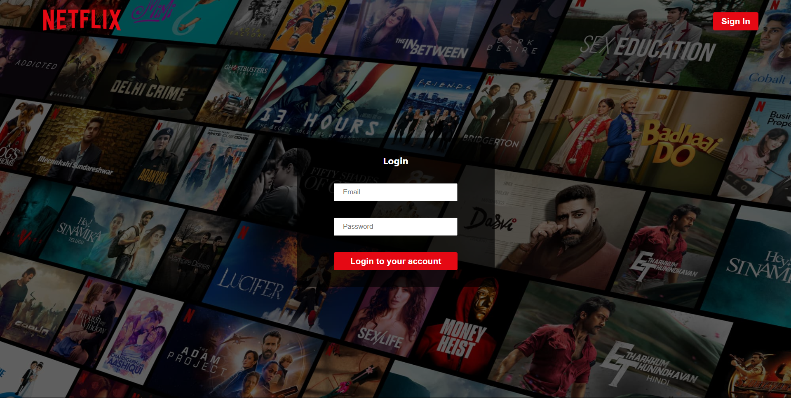

# 🎬 Netflix Clone — React + Firebase

Welcome to my **Netflix Clone** project — a modern web app inspired by Netflix's UI and functionality.  
Built using **React.js**, **Firebase**, and deployed with **Vercel**, this app showcases my ability to integrate frontend and backend technologies seamlessly.

🌐 **Live Site:** [https://netflix-clone-react-app-one.vercel.app/](https://netflix-clone-react-app-one.vercel.app/)

---

## 🖼️ Preview

| Home Page | Movie Detail |
|:--:|:--:|
|  |  |

---

## 📌 Features

✅ **User Authentication** (Sign Up / Login / Logout)  
✅ **Firebase Firestore + Auth integration**  
✅ **Styled components with clean UI**  
✅ **Responsive and mobile-friendly design**  
✅ **Dynamic movie rows powered by API**  
✅ **Deployed on Vercel**

---

## 🛠️ Technologies Used

- **React.js**
- **Firebase (Authentication, Firestore)**
- **Axios**
- **TMDB API**
- **Vercel (Frontend Deployment)**

---
